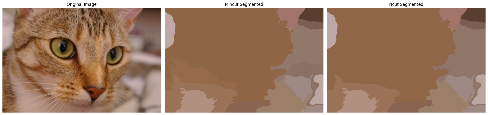

# ImSeg
Quick n' easy image segmentation tool for python.


Note: please do `pip install requirements.txt`

## Example Code
```python
import imseg
from skimage import data


img = data.cat()
G = imseg.Graph(img, 50, 1)#img, # of segments, connectedness
mincut_list = G.mincut_segment(10)#threshold
ncut_list = G.ncut_segment(10)
labels_mincut = G.paint(mincut_list)#show segments by avg colour
labels_ncut = G.paint(ncut_list)


from matplotlib import pyplot as plt
fig, ax = plt.subplots(ncols=3, sharex=True,
                        sharey=True, figsize=(20, 8))
ax[0].imshow(img)
ax[0].set_title("Original Image")
ax[1].imshow(labels_mincut)
ax[1].set_title("Mincut Segmented")
ax[2].imshow(labels_ncut)
ax[2].set_title("Ncut Segmented")
for a in ax:
    a.axis('off')
plt.tight_layout()
```

## Output:
